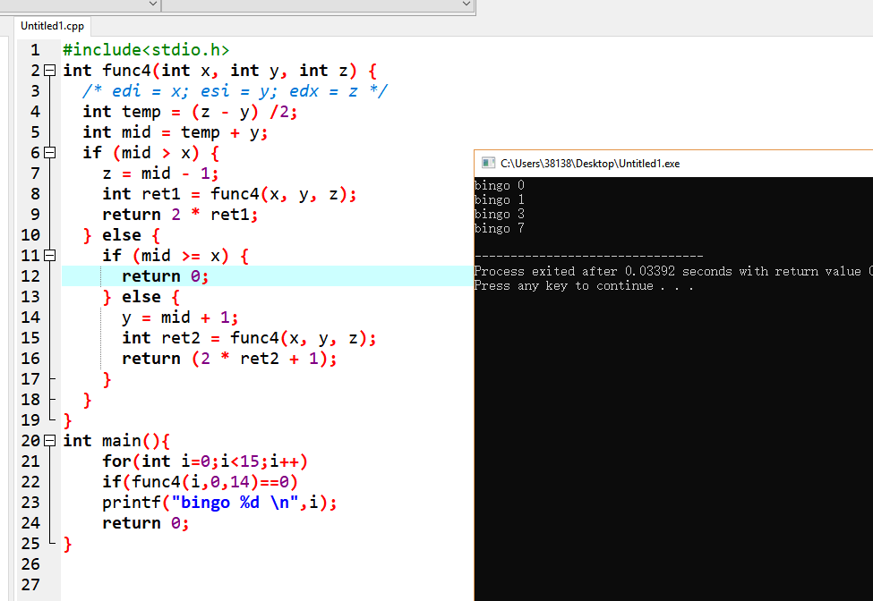
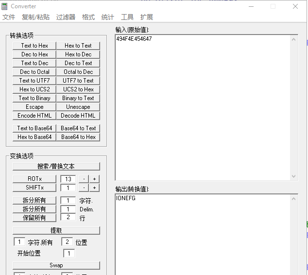

## phase_1
核心代码
```
400ee4:	be 00 24 40 00       	mov    $0x402400,%esi
400ee9:	e8 4a 04 00 00       	callq  401338 <strings_not_equal>
400eee:	85 c0                	test   %eax,%eax
400ef0:	74 05                	je     400ef7 <phase_1+0x17>
400ef2:	e8 43 05 00 00       	callq  40143a <explode_bomb>
400ef7:	48 83 c4 08          	add    $0x8,%rsp
```
第一行把$0x402400赋值给 %esi,我们可以通过gdb查看这个地址储存了什么东西

找到字符串`Border relations with Canada have never been better.`
然后调用strings_not_equal是否相等函数，
然后比较了%eax,%eax如果相等那么跳过了爆炸函数而正常运行下去，所以第一题只需要输入
```
Border relations with Canada have never been better.
```
## phase_2
要求读取6个数，并且首地址放在%rsp上
```
400f05:	e8 52 05 00 00       	callq  40145c <read_six_numbers>
```
然后判断（%rsp）是否为1,所以第一个数要是1,否则直接跳转到爆炸
```
400f0a:	83 3c 24 01          	cmpl   $0x1,(%rsp)
400f0e:	74 20                	je     400f30 <phase_2+0x34>
400f10:	e8 25 05 00 00       	callq  40143a <explode_bomb>
```
然后跳转到此地
```
400f30:	48 8d 5c 24 04       	lea    0x4(%rsp),%rbx
400f35:	48 8d 6c 24 18       	lea    0x18(%rsp),%rbp
400f3a:	eb db                	jmp    400f17 <phase_2+0x1b>
```
栈长度设置为了24个字节，并且把第二个值放在了%rbx,然后跳到400f17
```
400f17:	8b 43 fc             	mov    -0x4(%rbx),%eax
400f1a:	01 c0                	add    %eax,%eax
400f1c:	39 03                	cmp    %eax,(%rbx)
400f1e:	74 05                	je     400f25 <phase_2+0x29>
400f20:	e8 15 05 00 00       	callq  40143a <explode_bomb>
```
让%eax等于当前值的前一个值，比如当%rbx是第二个值的时候，%eax是第一个值，然后让前一个值乘了2,和(%rbx)比较，如果不相99等就直接爆了，否则跳到
```
400f25:	48 83 c3 04          	add    $0x4,%rbx
400f29:	48 39 eb             	cmp    %rbp,%rbx
400f2c:	75 e9                	jne    400f17 <phase_2+0x1b>
400f2e:	eb 0c                	jmp    400f3c <phase_2+0x40>
```
这里让%rbx往后移了一个整数位，并且判断是否到了临界点，如果没有到rbp那么回到两倍的那里，如果到了就跳转到400f3c
```
400f3c:	48 83 c4 28          	add    $0x28,%rsp
400f40:	5b                   	pop    %rbx
400f41:	5d                   	pop    %rbp
400f42:	c3                   	retq   
```
第二关结束，所以要求输入
```
1 2 4 8 16 32 
```
## phase_3
首先有一个输入，使用gdb查看一下输入的格式
```
  pwndbg> p (char*)0x4025cf
  $1 = 0x4025cf "%d %d"
```
然后比较返回值
```
  400f60:	83 f8 01             	cmp    $0x1,%eax
  400f63:	7f 05                	jg     400f6a <phase_3+0x27>
  400f65:	e8 d0 04 00 00       	callq  40143a <explode_bomb>
```
如果大于1往后走，否则爆了，而这个返回值是scanf的返回值，意思是我们输入的整数的个数，所以这题输入2个值。
```
  400f6a:	83 7c 24 08 07       	cmpl   $0x7,0x8(%rsp)
  400f6f:	77 3c                	ja     400fad <phase_3+0x6a>
  400f71:	8b 44 24 08          	mov    0x8(%rsp),%eax
  400f75:	ff 24 c5 70 24 40 00 	jmpq   *0x402470(,%rax,8)
```
然后比较了第一个值如果大于7那么直接爆炸了，然后把第一个值赋值给了eax,然后跳转到jmpq   *0x402470(,%rax,8)，即0x402470地址往后移动%rax个字节，一个字节为8位，所以我们先看看跳转表怎么样
```
  pwndbg> x/10xg 0x402470
  0x402470:	0x0000000000400f7c	0x0000000000400fb9
  0x402480:	0x0000000000400f83	0x0000000000400f8a
  0x402490:	0x0000000000400f91	0x0000000000400f98
  0x4024a0:	0x0000000000400f9f	0x0000000000400fa6
  0x4024b0 <array.3449>:	0x737265697564616d	0x6c796276746f666e
```
当%rax为0的时候跳转到0x0000000000400f7c
```
  400f7c:	b8 cf 00 00 00       	mov    $0xcf,%eax
  400f81:	eb 3b                	jmp    400fbe <phase_3+0x7b>
```
把$0xcf传入%eax,和第二个数比较，如果相等就结束，否则爆炸
```
  400fbe:	3b 44 24 0c          	cmp    0xc(%rsp),%eax
  400fc2:	74 05                	je     400fc9 <phase_3+0x86>
  400fc4:	e8 71 04 00 00       	callq  40143a <explode_bomb>
```
很明显能看到是一个switch结构，0xcf等于207
所以答案不为一，可以为
```
  0 207
```
## phase_4
首先有一个输入，使用gdb查看一下输入的格式
```
  pwndbg> p (char*)0x4025cf
  $1 = 0x4025cf "%d %d"
```
然后通过这一行判断我们读入数字的个数,即2个，并且第一个数在rsp上第二个在rcx上
```
  401029:	83 f8 02             	cmp    $0x2,%eax
  40102c:	75 07                	jne    401035 <phase_4+0x29>
```
然后对第一个数比较了，jbe为无符号小于等于则跳转，即我们的第一个数小于等于14
```
  40102e:	83 7c 24 08 0e       	cmpl   $0xe,0x8(%rsp)
  401033:	76 05                	jbe    40103a <phase_4+0x2e>
  401035:	e8 00 04 00 00       	callq  40143a <explode_bomb>
```
然后把0xe赋值给%edx,0x0赋值给%esi,我们输入的第一个值给%edi，然后调用了func4
然后判断%eax是否为空
```
  40104d:	85 c0                	test   %eax,%eax
  40104f:	75 07                	jne    401058 <phase_4+0x4c>
```
相当于给func4传入3个参数（%edi{我们输入的},%esi{0x0},%edx{0xe},并且答案等于0
现在分析func4
假设func4(int x,int y,int z)
那么首先的
```
  400fd2:	89 d0                	mov    %edx,%eax
  400fd4:	29 f0                	sub    %esi,%eax
```
%eax为z-y,然后一段操作
```
  400fd6:	89 c1                	mov    %eax,%ecx
  400fd8:	c1 e9 1f             	shr    $0x1f,%ecx
  400fdb:	01 c8                	add    %ecx,%eax
```
很奇怪先让%ecx等于0,然后再加上%eax，其实还是%eax还是值z-y啊，估计是为了防止负数吧
然后
```
  400fdd:	d1 f8                	sar    %eax
```
算术右移，其实就是处以2,然后  
```
400fdf:	8d 0c 30             	lea    (%rax,%rsi,1),%ecx
```
让%ecx=%rax+%rsi即等于（y-z）/2 + y
```
  400fe2:	39 f9                	cmp    %edi,%ecx
  400fe4:	7e 0c                	jle    400ff2 <func4+0x24>
  400fe6:	8d 51 ff             	lea    -0x1(%rcx),%edx
  400fe9:	e8 e0 ff ff ff       	callq  400fce <func4>
```
如果x大于%ecx就跳到400ff2
  否则 调用
  ```
    400fe9:	e8 e0 ff ff ff       	callq  400fce <func4>
    400fee:	01 c0                	add    %eax,%eax
  ```
  并且加倍
400ff2 让%eax=0
```
  400ff7:	39 f9                	cmp    %edi,%ecx
  400ff9:	7d 0c                	jge    401007 <func4+0x39>
  400ffb:	8d 71 01             	lea    0x1(%rcx),%esi
  400ffe:	e8 cb ff ff ff       	callq  400fce <func4>
  401003:	8d 44 00 01          	lea    0x1(%rax,%rax,1),%eax
  401007:	48 83 c4 08          	add    $0x8,%rsp
  40100b:	c3                   	retq   
```
整体函数大致为
```
int func4(int x, int y, int z) {
  /* edi = x; esi = y; edx = z */
  int temp = (z - y) /2;
  int mid = temp + y;
  if (mid > x) {
    z = mid - 1;
    int ret1 = func4(x, y, z);
    return 2 * ret1;
  } else {
    if (mid >= x) {
      return 0;
    } else {
      y = mid + 1;
      int ret2 = func4(x, y, z);
      return (2 * ret2 + 1);
    }
  }
}

```
最后判断了第二个数是不是0,如果不是就爆
```
  401051:	83 7c 24 0c 00       	cmpl   $0x0,0xc(%rsp)
  401056:	74 05                	je     40105d <phase_4+0x51>
  401058:	e8 dd 03 00 00       	callq  40143a <explode_bomb>
```
最终脚本为
```
include<stdio.h>
int func4(int x, int y, int z) {
  /* edi = x; esi = y; edx = z */
  int temp = (z - y) /2;
  int mid = temp + y;
  if (mid > x) {
    z = mid - 1;
    int ret1 = func4(x, y, z);
    return 2 * ret1;
  } else {
    if (mid >= x) {
      return 0;
    } else {
      y = mid + 1;
      int ret2 = func4(x, y, z);
      return (2 * ret2 + 1);
    }
  }
}
int main(){
	for(int i=0;i<15;i++)
	if(func4(i,0,14)==0)
	printf("bingo %d \n",i);
	return 0;
}

```
所以答案可以为
```
0 0
1 0
3 0
7 0
```

## phase_5
观察发现前面的代码没啥用从这里开始
```
  40107a:	e8 9c 02 00 00       	callq  40131b <string_length>
  40107f:	83 f8 06             	cmp    $0x6,%eax
  401082:	74 4e                	je     4010d2 <phase_5+0x70>
  401084:	e8 b1 03 00 00       	callq  40143a <explode_bomb>
```
这里判断长度为6
然后%eax为0
```
  4010d2:	b8 00 00 00 00       	mov    $0x0,%eax
  4010d7:	eb b2                	jmp    40108b <phase_5+0x29>
```
然后操作了%eax数组 每个值等于0x4024b0数组(数组B)的下标


```
  40108b:	0f b6 0c 03          	movzbl (%rbx,%rax,1),%ecx
  40108f:	88 0c 24             	mov    %cl,(%rsp)
  401092:	48 8b 14 24          	mov    (%rsp),%rdx
  401096:	83 e2 0f             	and    $0xf,%edx
```
即 %eax`[v2]`=B[(我们输入的那个数组 + v2)&0xF]
其中&0xF就是取后4位，我们先确定我们要拿的字符串数组

```
pwndbg> p (char*)0x4024b0
$1 = 0x4024b0 <array> "maduiersnfotvbylSo you think you can stop the bomb with ctrl-c, do you?"
```

最后判断是否和0x401338相等 我们看看$0x40245e是啥
```
pwndbg> p (char*)0x40245e
$2 = 0x40245e "flyers"

```
问题就简单了，只要我们输入的字符串的ascii的值后4位组成的数字作为下标在0x4024b0中找到flyers
对应关系为
f->9
l->15
y->14
e->5
r->5
s->7
我们可以构造大写的，就是0x4开头的，就是0x49,0x4f,0x4E,0x45,0x46,0x46
最后拿到答案

```
IONEFG
```

综合payload
```
Border relations with Canada have never been better.
1 2 4 8 16 32 
0 207
0 0
IONEFG
```